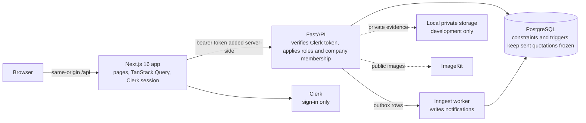
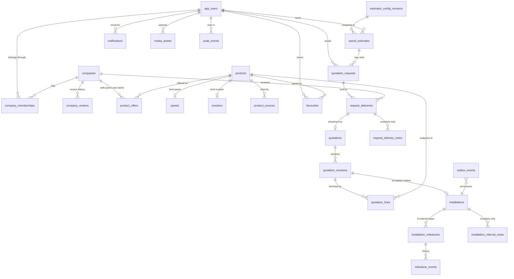

# Solar Lanka

Solar Lanka is a solar energy portfolio web application for exploring solar products, estimating system requirements, comparing company quotations, and tracking installation progress.

**Status: Phase 1 (core release) is built and tested; deployment is a later phase.** Everything uses fictional companies and sample prices. Contents: [setup](#setup-from-a-fresh-checkout), [architecture](#architecture), [database diagram](#database-relationships), [API documentation](#api-documentation), [demo accounts](#demo-accounts), [walkthrough](#guided-walkthrough), [browser tests](#browser-tests-phase-17), [scope acceptance](#core-scope-acceptance-phase-1).

## Backend (Phase 1 API) — status: complete

The backend gate is passed: the core journey (estimate → request → compare → accept → track) works through the API, proven by `backend/tests/test_core_journey.py`. The frontend (Phase 13 onward) can begin.

### Run it

Run from `backend/`. Docker only provides PostgreSQL; no Make target manages containers.

1. Copy the root `.env.example` to `.env` and set both database passwords. Copy `backend/.env.example` to `backend/.env` and `backend/.env.test.example` to `backend/.env.test`, using the same passwords.
2. Install dependencies: `uv sync --locked --group dev` (from `backend/`). Start PostgreSQL from the repository root: `docker compose up -d postgres`, plus `docker compose --profile test up -d postgres-test` for tests.
3. Create the schema and demo data: `make migrate`, then `.venv/bin/python -m app.seed_demo` (safe to repeat).
4. Start the API: `.venv/bin/uvicorn app.main:create_app --factory --reload`. Interactive docs are at `/docs`; `/health` and `/health/ready` are probes.

### Verify it (the gate)

- `.venv/bin/ruff check . && .venv/bin/ruff format --check .`
- `make migrate-test`, then `.venv/bin/python -m pytest --database` (needs the test container). Without `--database` the PostgreSQL tests are skipped.
- `.venv/bin/python -m app.benchmark_demo` records demo-scale timings. Point `SOLAR_DATABASE_URL` at a disposable migrated and seeded database first.

### Integrations

All integration settings are backend-only and documented with dummy values in `backend/.env.example`.

- **Clerk** (identity): the API verifies Clerk bearer tokens and keeps roles and company memberships locally. Demo data creates no logins; create demo users in a Clerk development instance.
- **ImageKit** (public media): upload authorisation and verification; private documents use local private storage in development.
- **Inngest** (background work): notifications are produced from a database outbox. Use the Inngest Dev Server locally; production needs both keys.
- **Arcjet** (abuse protection): rate limits on public and write routes. Unset `SOLAR_ARCJET_KEY` disables it in development; production requires it.

## Setup from a fresh checkout

Needs Docker (PostgreSQL only), Python with `uv`, Node with `pnpm`, and a free [Clerk](https://clerk.com) development instance for sign-in.

1. **Database and backend**: follow "Run it" above (root `.env` with two database passwords, `backend/.env` from `.env.example`, `uv sync --locked --group dev`, `docker compose up -d postgres`, `make migrate`, `.venv/bin/python -m app.seed_demo`, then `.venv/bin/python -m app.seed_e2e` for the extra demo people and a fictional estimator version). Both seeds can be repeated safely. Set the Clerk values in `backend/.env` (names are in `backend/.env.example`).
2. **Frontend**: in `frontend/`, copy `.env.example` to `.env`, fill the four Clerk values from the same Clerk instance and set `API_BASE_URL` to the backend address (for example `http://127.0.0.1:8000`), then `pnpm install` and `pnpm dev` (http://localhost:3000). The browser only ever calls this site's `/api` gateway, which adds the session token and forwards to the backend.
3. **Check it**: backend `.venv/bin/ruff check . && .venv/bin/python -m pytest --database` (needs `make migrate-test` and the test container); frontend `pnpm check`, `pnpm test`, `pnpm build`; browser tests as described below.

## Architecture



Roles: an account is a customer or a platform administrator; company administrators, sales and technicians are explicit memberships. Every company route checks the membership, every customer route checks ownership, and the frontend only hides what the backend would refuse anyway. Quotation totals, state changes and acceptance are decided by the backend in one transaction; the pages re-read after every refusal and explain from fresh state.

## Database relationships



The diagram shows the relationships that matter; the full column lists are in `backend/app/models/`. Table names follow the models (a few above are shortened). Companies' prices live in `product_offers`, never on the canonical `products`, and sent quotation revisions and their lines are made immutable by database triggers (migration 0029).

## API documentation

The API documents itself. With the backend running, interactive docs are at `/docs` (Swagger) and `/redoc`, and the machine-readable schema is `GET /openapi.json`. `.venv/bin/python -m app.export_openapi FILE` writes it to a file, and `pnpm api:types` in `frontend/` turns it into the typed client (`src/lib/api/schema.d.ts`), so the frontend cannot drift from the backend without a type error. Errors always look like `{"error": {"code", "message", "issues"}}`. Route groups: public catalogue, directory and estimate preview; `/users/me/...` (customer: estimates, requests, offers, installations, notifications); `/companies/{id}/...` (company staff); `/admin/...` and `/audit-events` (platform administrators); `/media/...` (uploads and private downloads).

## Estimator scenarios

Each scenario has its own published configuration (`grid_net_metering_no_backup`, `grid_net_accounting_no_backup`, `grid_net_plus_no_backup`) and an estimate only ever uses the latest published, unarchived version for its own connection scheme. Saved estimates keep the input, the full configuration (assumptions and source snapshots) and the result as they were, so publishing a newer version never changes them. Source for all schemes: PUCSL, [Rooftop Solar PV Connection Schemes](https://www.pucsl.gov.lk/rooftop-solar-pv-connection-schemes/), reviewed 2026-10-04. The page says it was last updated 2023-10-10 and lists feed-in rates "as of July 1, 2024" (27.06 LKR/kWh up to 500 kW), so the rate in a configuration must be rechecked and carries its own `effective_from` date.

| Scenario | Monthly value used | Worked example (300 kWh used, 250 kWh generated, 50% daytime use, 27.06 LKR/kWh, sample tariff) |
|---|---|---|
| Net metering | Excess is banked, not paid: the bill is recomputed on consumption minus generation | 5 090 LKR (bill falls from 5 500 to 410) |
| Net accounting | Daytime use offsets imports; the remainder is paid at the feed-in rate | 150 kWh used directly gives bill 2 500; 100 kWh exported earns 2 706; 5 500 - 2 500 + 2 706 = 5 706 LKR |
| Net plus | All generation is sold at the feed-in rate; the household bill is unchanged | 250 x 27.06 = 6 765 LKR |

Net accounting and net plus need an `export` source snapshot with an `effective_from` date and an `export_rate_lkr_per_kwh` low/high range in the configuration; without them (or, for net accounting, without the daytime-use percentage) the savings are left out rather than guessed. Net plus plus (power-plant arrangement above contract demand, roof rental, aggregators) is not modelled, and off-grid and hybrid systems have no sourced sizing data, so all three stay refused.

## Account and password recovery

Recovery is Clerk's; the app builds no reset tokens, reset pages or recovery tables. `/sign-in` renders Clerk's `<SignIn />`, which shows "Forgot password?" and emails a verification code once the Clerk instance allows it, and `/account` renders Clerk's `<UserProfile />` for changing the password or email while signed in. To enable it in your Clerk development instance, turn on the Password and Email verification code options under User & authentication (and keep email as an identifier). A unit test (`frontend/src/lib/recovery.test.ts`) fails if either page stops using Clerk's component or if any frontend or backend source or migration adds a password-reset or reset-token implementation. The local mail sink from 19.06 is not used for recovery: Clerk sends its own email.

## Demo accounts

The seeds create the people below with the roles and companies shown, but **no passwords exist**: sign-in is Clerk's. To sign in as one, create a user in your Clerk development instance, copy its user id (starts with `user_`) from the Clerk dashboard, and link it **before that user's first sign-in**:

```
cd backend
.venv/bin/python -m app.link_demo_account demo_seed_customer user_2abc...
```

| Demo subject | Role | Company | Use it to |
|---|---|---|---|
| `demo_seed_customer` | customer | none | follow the four seeded requests (draft, revised, expired and accepted offers) and the accepted installation |
| `demo_seed_company_a` | company administrator | Demo Sunbird Solar | answer enquiries, quote, manage installations |
| `demo_seed_company_b` | company administrator | Demo Moonleaf Energy | see another company's separate data |
| `demo_seed_company_c` | company administrator | Demo Lotus Solar | directory listing only |
| `e2e_sunbird_sales` | sales | Demo Sunbird Solar | same screens as the administrator, as sales |
| `e2e_sunbird_technician` | technician | Demo Sunbird Solar | open My visits (`/technician`) to see assigned site visits, add notes and photos, and complete a visit |
| `e2e_customer_new` | customer | none | every empty state |
| `e2e_customer_estimate`, `e2e_customer_two` | customer | none | run the whole workflow yourself without touching the seeded customer |
| `e2e_platform_admin` | platform administrator | none | review companies, edit the catalogue and estimator settings, read the audit log |
| `e2e_rival_admin` | company administrator | E2E Rival Solar | a second approved Colombo company, so offers can compete |

Anyone who signs in with a Clerk user that is not linked becomes an ordinary customer with no data.

## Guided walkthrough

Use two browser profiles (or a private window) so a customer and a company can be signed in at once.

1. **Browse without signing in**: Solar panels, Inverters (filters, then compare up to three; unknown values read "Not specified"), Companies, and Estimator (try 300 kWh a month, Colombo, 30 m², partial shading).
2. **As `e2e_customer_estimate`**: save the estimate, open My estimates, then Prepare a request from it and send it to Demo Sunbird Solar (and the rival, to see competing offers).
3. **As `demo_seed_company_a`**: open Enquiries, mark the enquiry opened, start a quotation draft, add lines, save (the totals come from the server) and send it. Try revising it to see the history.
4. **Back as the customer**: open the request, compare the offers (differences and "Not specified" are flagged, nothing is ranked), accept one. Try accepting the other: it is refused and explained.
5. **Track**: open the installation, then as the company start the first step, upload evidence and complete it, share a delay, and add an internal note. As the customer, see exactly what is shared, and that internal notes and evidence files are not.
6. **Notifications**: the customer sees each change under Notifications (the Inngest worker produces them; locally run it, or use the local processor `python -m app.jobs.process_outbox_locally`).
7. **As `e2e_platform_admin`**: review a company submission, edit a specification, publish a new estimator draft, and read the audit log.
8. **Site visit**: as `e2e_customer_estimate`, open the installation and request a visit with a time; as the company, confirm it with the technician (or offer other times); as `e2e_sunbird_technician`, open My visits, add a note and a photo and complete the visit once its time has come (the app refuses to complete a visit that has not started; for a demonstration, a visit scheduled for the past can only be made by editing its time in the database, which the browser tests do for you).

### Measured demo performance (17.09)

Measured on one developer laptop (Linux, PostgreSQL 16 in Docker, Python 3.14, Next.js production build), demo dataset only. These are demonstration figures, not capacity claims.

| What | Result |
|---|---|
| Fresh database: all migrations | about 2.4 s |
| Seeds (`app.seed_demo`, `app.seed_e2e`, the second run changes nothing) | under a second each, no manual database edit |
| Production build of the web app | about 24 s |
| API reads in process (30 runs after warm-up, `python -m app.benchmark_demo`) | median 18 to 50 ms, 95th percentile 23 to 56 ms across 13 endpoints; 3 to 9 queries each; no sequential scans |
| Slowest read | company revision history, median 49.6 ms (9 queries) |
| Over HTTP, warm | API health 35 ms, readiness 85 ms, catalogue list 23 ms; web pages 10 to 85 ms from the production server (the first request after start took 330 to 380 ms) |

### Known limitations

- Everything uses fictional companies and sample prices. Estimates are planning aids, not guarantees.
- Arcjet and Inngest were tested with fakes or locally, not against live services.
- Sign-in is Clerk's: demo people have no passwords and must be linked to Clerk users (see Demo accounts). Browser tests bypass sign-in with a signed test token.
- Technician workspace, site visits, support, troubleshooting, education content and document export are Phase 2; they appear only as "Coming soon".
- Three grid-connected, no-backup estimator scenarios are calculated by the API (net metering, net accounting, net plus; see Estimator scenarios); the estimate screen still offers only net metering, and net plus plus, off-grid and hybrid are not calculated. Every figure is a fictional planning aid.
- Evidence files use local private storage, which exists for development and tests only; notifications need the Inngest worker (or the local processor) running.
- Measurements cover the demo dataset on one machine; nothing was load-tested, and no real device or screen reader was used.
- Not yet built: deployment, CI, backups and monitoring (the later DevOps phase).

## Local release gate (17.10)

Run on one machine with a disposable database, before Phase 18 (deployment). All of these pass:

| Check | Command | Result |
|---|---|---|
| Backend lint and format | `ruff check .` and `ruff format --check .` | clean (239 files) |
| Backend tests, real PostgreSQL | `pytest --database` | 461 passed |
| Frontend lint and types | `pnpm check` | clean |
| Frontend unit tests | `pnpm test` | 302 passed |
| Frontend production build | `next build` | compiles, every route generated |
| Browser tests (desktop, tablet, mobile) | `playwright test` | 126 passed (in three runs of the same specs: layout 12, the four workflow specs 84, accessibility 30) |

Not part of this gate: CI, deployment, load testing and real-device checks (see Known limitations).

## Browser tests (Phase 17)

Playwright runs the real web app against the real API and a known database. No Clerk account or password is needed: a test-only gateway signs a token for the demo person each test chooses, and the API still verifies it (the sign-in bypass works only when `E2E_AUTH=1` outside production).

1. Create a disposable PostgreSQL database in the test container and export its address. From `backend/`: `.venv/bin/python ../frontend/e2e/support/database.py create`, then `export E2E_DATABASE_URL=$(.venv/bin/python ../frontend/e2e/support/database.py url)` (it reads the passwords in the root `.env`; never print the address). `drop` removes it afterwards.
2. From `frontend/`: `node_modules/.bin/playwright test` (or `pnpm e2e`). It migrates and seeds the database (`app.seed_demo` plus `app.seed_e2e`, both repeatable), starts the API and the signing proxy, starts the web app, and uses the Chrome installed on the machine. Projects: desktop (1280 px), tablet (iPad) and mobile (Pixel 7).
3. Layout is checked at 320 (small phone), 390 (phone), 768 (tablet), 1024 (tablet landscape) and 1280 (desktop) pixels wide: no sideways scrolling, and controls at least 24 px (WCAG 2.5.8; most are 44 px) at phone and tablet widths.
4. The demo people and what each can do are listed in `frontend/e2e/identities.ts`; `e2e/specs/foundation.spec.ts` checks that each one is who the table says and that the known data and the refusals are as expected.

## Core scope acceptance (Phase 1)

Each criterion from section 11 of the project scope, with the evidence for it. "Browser" means a Playwright test in `frontend/e2e/specs/`; backend files are in `backend/tests/`.

| # | Criterion | Status | Evidence |
|---|-----------|--------|----------|
| 1 | A reviewer can sign in with documented demo accounts for each supported role | Partly met | The seeds create the demo people (`app.seed_demo`, `app.seed_e2e`) and the API verifies Clerk tokens, but no passwords exist: a reviewer must create matching users in a Clerk development instance. Browser tests use a signed test token instead (`e2e/identities.ts`). Step-by-step instructions are 17.08. |
| 2 | Estimate, request, compare, accept, track | Met | Browser: `customer-acceptance.spec.ts` (estimate, request, offer, accept, tracking). API: `test_core_journey.py`. Saving an estimate from the page itself needs a real Clerk session and is covered through the API. |
| 3 | Company A cannot reach Company B's enquiries, quotations, notes or files | Met | Browser: `company-quotation.spec.ts`, `notifications-documents.spec.ts` (403 for other companies and technicians). API: `test_company_access.py`, `test_core_journey.py`. |
| 4 | Customers cannot read other customers' records by changing an id | Met | Browser: `foundation.spec.ts`, `notifications-documents.spec.ts` (404). API: `test_saved_estimate_access.py`, `test_request_reads.py`. |
| 5 | Catalogue filters and comparisons show consistent units and missing values | Met | Unit tests: `lib/catalogue/detail.test.ts`, `lib/comparison/table.test.ts`. API: `test_catalogue_public.py`, `test_comparison_favourites.py`. |
| 6 | Saved estimates keep the assumptions used | Met | `test_saved_estimate_snapshot.py`, `test_saved_estimate_history.py`, `test_estimator_config_admin.py` (published versions are immutable). |
| 7 | Quotation totals are calculated and validated by the backend | Met | `test_quotation_terms.py`, `test_quotation_edit_contract.py`; the browser form sends no totals (`company-quotation.spec.ts` reads the server's). |
| 8 | Sent revisions stay accessible and unchanged | Met | Database immutability in `test_migrations.py` and migration 0029; `test_quotation_current_read.py`; browser: the sent page offers no inputs (`company-quotation.spec.ts`). |
| 9 | Expired or superseded offers cannot be accepted | Met | `test_quotation_acceptance_policy.py`, `test_quotation_acceptance_transaction.py`; the screens explain refusals from fresh state (unit tests `lib/quotation/decision.test.ts`). |
| 10 | Concurrent acceptance cannot create two accepted offers for one request | Met | `test_quotation_acceptance_transaction.py::test_competing_acceptance_has_one_committed_winner` (real PostgreSQL); browser: the competing-offer test in `customer-acceptance.spec.ts`. |
| 11 | Implemented scheduling rejects conflicting technician visits | Deferred (Phase 2) | Technician workspace and site visits are not built, so there is nothing to conflict. |
| 12 | Invalid installation transitions are rejected with understandable errors | Met | API: `test_core_journey.py` (order and evidence rules), `test_quotation_states.py`; screens: `lib/installations/staff.test.ts` and the explanations from fresh state. |
| 13 | Private attachments require authorisation | Met | `test_private_media_routes.py`, `test_core_journey.py` (evidence), browser: `notifications-documents.spec.ts` (everyone else refused, signed out 401). |
| 14 | Critical workflows pass automated tests | Met | Backend suite (460 tests with `--database`), 302 frontend unit tests, 126 browser tests. |
| 15 | Works on desktop and mobile browser sizes | Met | Browser: `layout.spec.ts` (320 to 1280 px) and `accessibility.spec.ts` (axe, WCAG 2.2 AA). Emulated, not real devices. |
| 16 | Sample identities, prices and estimates are labelled | Met | Fictional names end in "(Fictional)" (`test_demo_seed.py`); prices carry "Sample price" and claims "Company declared, not verified"; the home page states the demonstration status; estimates say they are planning aids. |

### Deferred to Phase 2 or later (not part of the core release)

Technician workspace and conflict-checked site visits, support cases and sourced troubleshooting references, educational content, quotation document export, scheduled reminders, expanded estimator scenarios (only grid-connected net metering without backup is calculated), and everything in Phase 3 and the deployment phase. The navigation shows Learn, Troubleshooting and Support only as "Coming soon" cards, never as links.

