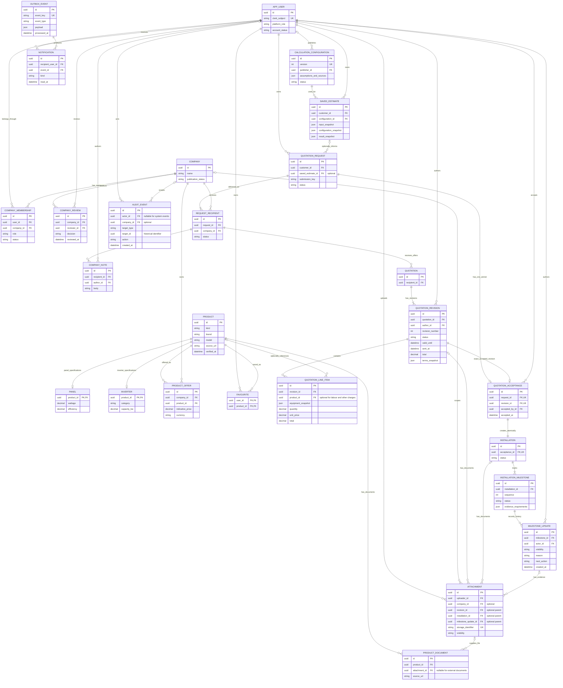

# Phase 1 entity relationship diagram

Draft logical model; this diagram does not create database tables. Attributes focus on identifiers, ownership, and important constraints. Clerk owns authentication sessions; `APP_USER` stores application identity and status, not passwords or login sessions.

## Ownership and consistency rules

- **Memberships:** unique `(company_id, user_id)`. Company permissions come from active membership and its role; platform permissions are separate. Public registration cannot choose privileged roles.
- **Products:** `PRODUCT` is a proposed shared identity for panels and inverters, making offers, favourites, and documents reference a real foreign key. Each product must have exactly the subtype matching its kind. Company prices remain in `PRODUCT_OFFER`.
- **Customer records:** estimates and requests belong to their customer. A linked estimate must belong to that same customer. Uniqueness on `(customer_id, submission_key)` prevents duplicate request submission.
- **Recipient isolation:** unique `(request_id, company_id)`. Every quotation and internal note belongs to one recipient delivery. Company ownership follows that delivery; companies cannot see competing deliveries, quotations, or notes. Authors must have authorised membership at the time of the action.
- **Revisions:** unique `(quotation_id, revision_number)`. A quotation starts with a draft revision; sent content, line items, prices, and terms become immutable snapshots. Lifecycle state may change only through validated transitions. Later product edits never rewrite sent offers.
- **Acceptance:** unique `request_id` permits one winner. The accepted revision must trace through its quotation and recipient to that request, and the accepting user must own it. Eligibility, matching relationships, concurrency protection, and creation of one installation must be enforced in one transaction; foreign keys alone cannot establish those cross-table rules.
- **Installation ownership:** customer and company are derived from the accepted revision's request/recipient chain, avoiding conflicting duplicated ownership. Milestone updates retain actor/time/reason and distinguish internal notes from customer-visible updates.
- **Files:** private attachments require exactly one authorised parent among revision, installation, and milestone update. Public product documents use `PRODUCT_DOCUMENT`; an external document may instead carry a source URL. Validate company scope against the parent. Uploader identity or possession of a storage identifier does not grant download access.
- **Estimates:** published configurations are immutable versions. Saved input/configuration/result snapshots preserve the original calculation even after a new version is published. Draft configurations may have no publisher yet; the publisher relationship is required on publication.
- **Notifications:** unique `(event_id, recipient_user_id, kind)` prevents duplicate processing. Write required outbox events with the business transaction; notification destination links still require authorisation.
- **History:** archive referenced users, companies, and products instead of cascading deletion through quotations or installations. Audit targets are historical identifiers, not an unrestricted access mechanism. Milestone sequence is unique within an installation.

`PRODUCT`, `QUOTATION_ACCEPTANCE`, `COMPANY_NOTE`, `MILESTONE_UPDATE`, and `OUTBOX_EVENT` are proposed supporting entities for the scoped workflows. Detailed fields, indexes, and enforcement mechanisms will be refined in their implementation steps. Education, visits, technician assignments, support cases, and translations belong to later releases and are not included here.
